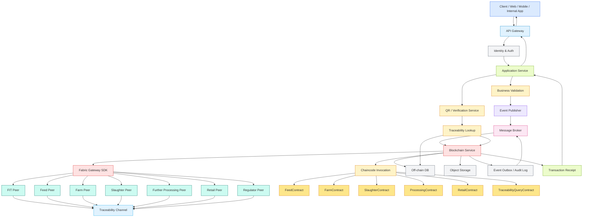

# Application + Blockchain Integration V1

## Purpose

This document describes the initial application-to-blockchain integration flow for the AXONS food traceability platform.

## Scope

This diagram focuses on the interaction between:

- client applications
- API gateway
- application services
- blockchain service layer
- Hyperledger Fabric peers
- off-chain storage
- QR verification flow

## Mermaid Diagram

## Integration Notes

### Write Flow

1. Client sends request to API Gateway
2. Gateway authenticates and forwards to application service
3. Service validates business rules
4. Blockchain service submits transaction through Fabric Gateway SDK
5. Fabric peers execute chaincode and commit transaction
6. Off-chain metadata is stored in database or object storage
7. Receipt is returned back to caller

### Read / Verification Flow

1. Consumer or internal user scans QR code
2. Verification service resolves traceability ID
3. Blockchain service queries Fabric for lineage proof
4. Off-chain data is fetched for detailed metadata
5. Verification result is returned to the user

## Suggested Next Refinements

- Add **transaction retry and timeout handling**
- Add **idempotency behavior** for duplicate submissions
- Add **event-driven asynchronous processing**
- Add **private data collection behavior**
- Add **permission enforcement points** for API, service, and chaincode

## Optional Future Versions

A second version can show:

- exact **microservice boundaries**
- **RabbitMQ / SQS** flow details
- **audit logging** and observability paths
- **regulator read-only access**
- **QR service to blockchain service integration**
