# Fabric Network Topology V1

## Purpose

This document captures the first version of the Hyperledger Fabric network topology for the AXONS food traceability platform.

## Scope

This diagram focuses on the **minimal viable Fabric deployment** for the initial phase:

- permissioned consortium network
- one channel
- one peer per participating organization
- shared ordering service
- organization-level CA and identity
- chaincode boundaries for traceability transactions

## Mermaid Diagram

```mermaid
flowchart TD
    subgraph Consortium
        A[Orderer Organization]
        B[FIT Org]
        C[Feed Org]
        D[Farm Org]
        E[Slaughter Org]
        F[Further Processing Org]
        G[Retail Org]
        H[Regulator Org]
    end

    subgraph Orderer Plane
        A1[Orderer Node 1]
        A2[Orderer Node 2]
        A3[Orderer Node 3]
        A4[Raft Consensus]
    end

    subgraph Peer Plane
        B1[FIT Peer]
        C1[Feed Peer]
        D1[Farm Peer]
        E1[Slaughter Peer]
        F1[Further Processing Peer]
        G1[Retail Peer]
        H1[Regulator Peer]
    end

    subgraph Identity Plane
        B2[FIT CA]
        C2[Feed CA]
        D2[Farm CA]
        E2[Slaughter CA]
        F2[Further Processing CA]
        G2[Retail CA]
        H2[Regulator CA]
    end

    subgraph Channel Plane
        I[Traceability Channel]
    end

    subgraph Chaincode Plane
        J[FeedContract]
        K[FarmContract]
        L[SlaughterContract]
        M[ProcessingContract]
        N[RetailContract]
        O[TraceabilityQueryContract]
    end

    A --> A1
    A --> A2
    A --> A3
    A1 --> A4
    A2 --> A4
    A3 --> A4

    B --> B1
    C --> C1
    D --> D1
    E --> E1
    F --> F1
    G --> G1
    H --> H1

    B --> B2
    C --> C2
    D --> D2
    E --> E2
    F --> F2
    G --> G2
    H --> H2

    B1 --> I
    C1 --> I
    D1 --> I
    E1 --> I
    F1 --> I
    G1 --> I
    H1 --> I

    I --> J
    I --> K
    I --> L
    I --> M
    I --> N
    I --> O

    J --> B1
    J --> C1
    K --> C1
    K --> D1
    L --> D1
    L --> E1
    M --> E1
    M --> F1
    N --> F1
    N --> G1
    O --> B1
    O --> C1
    O --> D1
    O --> E1
    O --> F1
    O --> G1
    O --> H1

    subgraph App Layer
        P[API Gateway]
        Q[Blockchain Service]
        R[Off-chain DB]
        S[Object Storage]
    end

    P --> Q
    Q --> B1
    Q --> C1
    Q --> D1
    Q --> E1
    Q --> F1
    Q --> G1
    Q --> H1

    Q --> R
    Q --> S

    style A fill:#dbeafe,stroke:#2563eb,stroke-width:1px
    style B fill:#ecfccb,stroke:#65a30d,stroke-width:1px
    style C fill:#ecfccb,stroke:#65a30d,stroke-width:1px
    style D fill:#fef3c7,stroke:#d97706,stroke-width:1px
    style E fill:#fee2e2,stroke:#dc2626,stroke-width:1px
    style F fill:#ede9fe,stroke:#7c3aed,stroke-width:1px
    style G fill:#ccfbf1,stroke:#0f766e,stroke-width:1px
    style H fill:#fce7f3,stroke:#db2777,stroke-width:1px
    style I fill:#e0f2fe,stroke:#0ea5e9,stroke-width:1px
    style J fill:#fef3c7,stroke:#d97706,stroke-width:1px
    style K fill:#fef3c7,stroke:#d97706,stroke-width:1px
    style L fill:#fef3c7,stroke:#d97706,stroke-width:1px
    style M fill:#fef3c7,stroke:#d97706,stroke-width:1px
    style N fill:#fef3c7,stroke:#d97706,stroke-width:1px
    style O fill:#fef3c7,stroke:#d97706,stroke-width:1px
```

## Design Notes

### Minimal Deployment Assumptions

- One **channel** for all organizations
- One **peer per organization** for initial deployment
- One **shared orderer service** using Raft
- **CA per organization** for identity issuance
- **Chaincode installed on each peer**

### Why this topology is a good starting point

- Keeps onboarding simple
- Reduces operational complexity
- Supports consortium-based trust
- Makes it easier to debug endorsement and commit behavior

### Governance Perspective

- All participating organizations join the same channel
- Each organization controls its own identity and peer
- Regulators can read traceability data without writing operational transactions
- Private data can be introduced later when confidentiality requirements increase

## Suggested Next Refinements

- Add **private data collections** for sensitive records
- Add **anchor peers** for organization discovery
- Add **TLS / mTLS** annotations
- Add **fabric-ca and cli container** references
- Add **service-to-peer connection details** for the application layer

## Optional Future Versions

A second version can show:

- dedicated **endorsement policies** per chaincode
- **peer gossip / channel communication**
- **storage integration** for off-chain metadata
- **regulator-only read paths**
