# Organization & Governance V1

## Purpose

This document describes the initial organization and governance model for the AXONS food traceability consortium using Mermaid.

## Scope

This diagram covers:

- consortium membership
- organizational responsibilities
- governance roles
- access boundaries
- regulator visibility

## Mermaid Diagram

```mermaid
flowchart TD
    A[Axons Food Traceability Consortium] --> B[FIT]
    A --> C[Feed]
    A --> D[Farm]
    A --> E[Slaughter]
    A --> F[Further Processing]
    A --> G[Retail]
    A --> H[Regulator]

    B --> B1[Source ingredients]
    B --> B2[Supplier validation]

    C --> C1[Produce feed batches]
    C --> C2[Transfer feed ownership]

    D --> D1[Register animal lots]
    D --> D2[Assign feed]
    D --> D3[Record farm lifecycle]

    E --> E1[Create slaughter batches]
    E --> E2[Record carcass data]

    F --> F1[Transform products]
    F --> F2[Create packaged retail items]

    G --> G1[Manage retail inventory]
    G --> G2[Verify QR / consumer access]

    H --> H1[Read-only audit access]
    H --> H2[Compliance review]
    H --> H3[Traceability investigation]

    subgraph Governance
        I[Fabric CA]
        J[MSP / X.509 identities]
        K[RBAC]
        L[Least privilege]
        M[Append-only ledger]
    end

    B -.-> I
    C -.-> I
    D -.-> I
    E -.-> I
    F -.-> I
    G -.-> I
    H -.-> I

    B -.-> J
    C -.-> J
    D -.-> J
    E -.-> J
    F -.-> J
    G -.-> J
    H -.-> J

    K --> B
    K --> C
    K --> D
    K --> E
    K --> F
    K --> G
    K --> H

    L --> K
    M --> A

    style A fill:#dbeafe,stroke:#2563eb,stroke-width:1px
    style B fill:#ecfccb,stroke:#65a30d,stroke-width:1px
    style C fill:#ecfccb,stroke:#65a30d,stroke-width:1px
    style D fill:#fef3c7,stroke:#d97706,stroke-width:1px
    style E fill:#fee2e2,stroke:#dc2626,stroke-width:1px
    style F fill:#ede9fe,stroke:#7c3aed,stroke-width:1px
    style G fill:#ccfbf1,stroke:#0f766e,stroke-width:1px
    style H fill:#fce7f3,stroke:#db2777,stroke-width:1px
    style I fill:#f3f4f6,stroke:#4b5563,stroke-width:1px
    style J fill:#f3f4f6,stroke:#4b5563,stroke-width:1px
    style K fill:#f3f4f6,stroke:#4b5563,stroke-width:1px
    style L fill:#f3f4f6,stroke:#4b5563,stroke-width:1px
    style M fill:#f3f4f6,stroke:#4b5563,stroke-width:1px
```

## Governance Rules

### Organization Responsibilities

- **FIT**: source ingredients and validate suppliers
- **Feed**: create feed batches and transfer feed ownership
- **Farm**: register animal lots and assign feed
- **Slaughter**: create slaughter batches and record carcass data
- **Further Processing**: transform products and create packaged goods
- **Retail**: manage retail inventory and verify QR-based traceability
- **Regulator**: audit, investigate, and review compliance records

### Access Control Principles

- All organizations use **Fabric CA** and **X.509 identities**
- Access is controlled by **RBAC**
- The model follows **least privilege**
- Ledger updates are **append-only**
- Regulators have **read-only audit access**

### Suggested Diagram Notes

- The diagram is intentionally **business-first** and **governance-focused**.
- The blockchain identity layer is shown as a **shared governance control**.
- A future version can refine the **private data / public data** boundaries.

## Optional Future Extensions

- Add **service identities** for backend APIs
- Add **application-layer permissions** for UI and API access
- Add **cross-organization approval paths**
- Add **incident / recall workflows**
