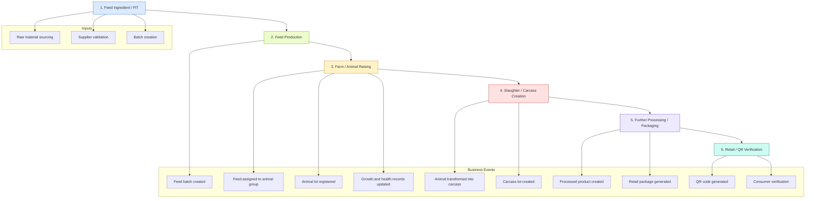

# Traceability Flow V1

## Purpose

This document captures the first version of the food traceability flow using Mermaid so it can be reviewed, refined, and later converted into a more formal architecture diagram.

## Flow Summary

The 1-6 flow represents the main lifecycle of a food product in the AXONS traceability platform:

1. Feed ingredient sourcing
2. Feed production
3. Animal raising / farm operations
4. Slaughter and carcass creation
5. Processing and packaging
6. Retail verification and consumer access

## Mermaid Flowchart

## Suggested Next Refinements

- Add the **on-chain vs off-chain boundary** to the flow.
- Add **ownership transfer events** between organizations.
- Add **verification points** for regulators and consumers.
- Add **error or exception states**, such as rejected batch, quarantine, or recall.

## Recommended Diagram Style

- Use **Mermaid** for quick design iteration.
- Keep nodes **business-focused** first.
- Add **blockchain annotations** after the business flow is stable.

## Optional Future Version

A second version can show:

- API Gateway
- Blockchain service layer
- Fabric peer connections
- off-chain database writes
- QR verification lookup
